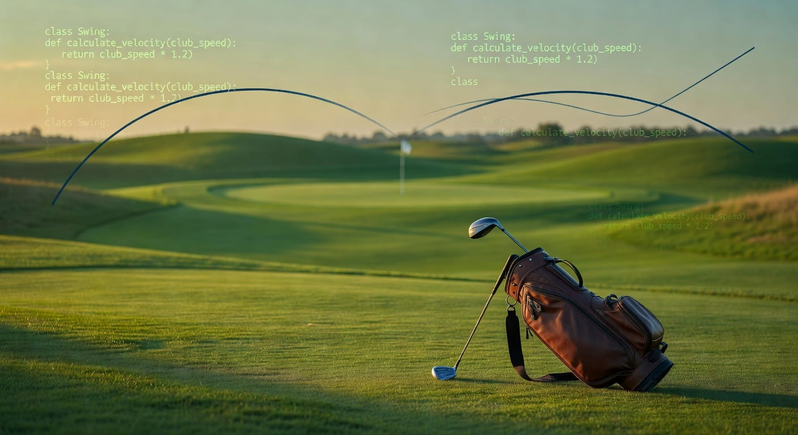

<p align="center">
  
</p>

# arccos-api

Unofficial Python client and CLI for the [Arccos Golf](https://arccosgolf.com) platform.

Arccos provides no public API. This library was reverse-engineered from the Arccos Dashboard web app. It gives you full programmatic access to your own golf data — rounds, handicap, club distances, pace of play, and more.

> **Unofficial.** Not affiliated with Arccos Golf LLC. Use with your own account only. Respect their servers (no aggressive polling).

## Installation

```bash
pip install arccos-api
```

Or install from source:

```bash
git clone https://github.com/pfrederiksen/arccos-api.git
cd arccos-api
pip install -e .
```

Requires Python >= 3.11. Dependencies: `requests`, `click`, `rich`.

## CLI

### Quick start

```bash
arccos login       # authenticate and save credentials
arccos rounds      # your recent rounds
arccos handicap    # handicap breakdown
arccos clubs       # smart club distances
```

### Commands

| Command | Description |
|---------|-------------|
| `arccos login` | Authenticate and cache credentials to `~/.arccos_creds.json` |
| `arccos rounds` | List recent rounds with date, score, +/-, course name |
| `arccos round <id>` | Hole-by-hole detail (score, putts, FIR, GIR) with totals |
| `arccos handicap` | Handicap breakdown by category (overall, driving, approach, etc.) |
| `arccos clubs` | Smart club distances with make/model, range, and shot count |
| `arccos bests` | All-time personal bests (lowest score, longest drive, etc.) |
| `arccos overview` | Performance summary — scoring avg + handicap breakdown |
| `arccos scoring` | Scoring trend with visual bar chart |
| `arccos courses` | List all courses you've played |
| `arccos pace` | Pace of play analysis by course (color-coded) |
| `arccos stats <id>` | Strokes gained analysis for a round |
| `arccos export` | Export rounds to JSON, CSV, or NDJSON (`--detail` for hole data) |
| `arccos logout` | Clear cached credentials |

Every command supports `--json` for raw JSON output and `--help` for usage info.

### Usage examples

```bash
# Rounds
arccos rounds                         # last 20 rounds (with +/- and course names)
arccos rounds -n 50                   # last 50
arccos rounds --after 2025-01-01      # filter by date
arccos rounds --course "pebble"       # filter by course name (substring)
arccos rounds --json                  # raw JSON

# Round detail
arccos round 18294051                 # hole-by-hole breakdown

# Handicap
arccos handicap                       # category breakdown
arccos handicap --history             # revision history

# Club distances
arccos clubs                          # active clubs with make/model
arccos clubs --after 2025-01-01       # distances from this year only

# Performance
arccos bests                          # all-time personal bests
arccos overview                       # scoring avg + handicap breakdown
arccos scoring                        # scoring trend with bar chart

# Courses
arccos courses                        # all courses played

# Pace of play
arccos pace                           # all rounds, slowest courses first
arccos pace -n 20                     # last 20 rounds only

# Export
arccos export -f csv -o rounds.csv    # export to CSV file
arccos export --detail                # include hole-by-hole data
arccos export -f json                 # dump JSON to stdout
arccos export -f ndjson               # newline-delimited JSON
```

### Example output

```
$ arccos clubs
            Smart Club Distances
╭──────┬──────────────────┬───────┬─────────┬──────────┬───────╮
│ Club │ Model            │ Smart │ Longest │    Range │ Shots │
├──────┼──────────────────┼───────┼─────────┼──────────┼───────┤
│ Dr   │ TaylorMade Qi10  │  252y │    291y │ 245–263y │   312 │
│ 3w   │ TaylorMade Qi10  │  228y │    248y │ 220–235y │    87 │
│ 5w   │ Callaway Paradym │  208y │    231y │ 200–215y │   143 │
│ 4h   │ Titleist T200    │  195y │    214y │ 188–202y │    61 │
│ 6i   │ Titleist T150    │  172y │    190y │ 165–179y │    94 │
│ 7i   │ Titleist T150    │  160y │    178y │ 153–167y │   118 │
│ 8i   │ Titleist T150    │  148y │    165y │ 141–155y │   105 │
│ 9i   │ Titleist T150    │  136y │    152y │ 130–142y │    97 │
│ Pw   │ Titleist T150    │  124y │    140y │ 118–130y │    82 │
│ 50   │ Vokey SM10       │  108y │    125y │ 102–114y │    76 │
│ 54   │ Vokey SM10       │   88y │    105y │  82–94y  │   201 │
│ 58   │ Vokey SM10       │   64y │     88y │  58–70y  │   168 │
╰──────┴──────────────────┴───────┴─────────┴──────────┴───────╯

$ arccos round 18294051
╭─── Round 18294051 ────╮
│ Date:   2025-09-14    │
│ Course: Torrey Pines  │
│ Score:  79 (+7)       │
│ Holes:  18            │
╰───────────────────────╯
            Hole-by-Hole
╭──────┬───────┬───────┬─────┬─────╮
│ Hole │ Score │ Putts │ FIR │ GIR │
├──────┼───────┼───────┼─────┼─────┤
│    1 │     4 │     2 │  T  │  T  │
│    2 │     5 │     2 │  F  │  F  │
│    3 │     3 │     1 │     │  T  │
│  ... │   ... │   ... │ ... │ ... │
├──────┼───────┼───────┼─────┼─────┤
│  Tot │    79 │    31 │     │     │
╰──────┴───────┴───────┴─────┴─────╯

$ arccos handicap
  Handicap Breakdown
╭────────────┬───────╮
│ Category   │   HCP │
├────────────┼───────┤
│ Overall    │ -12.4 │
│ Driving    │ -15.1 │
│ Approach   │ -18.7 │
│ Short Game │ -14.3 │
│ Putting    │  -6.2 │
╰────────────┴───────╯

$ arccos pace -n 10
Pace of Play — 10 rounds across 6 courses   Overall avg: 4h 22m

                  By Course (slowest first)
╭────┬──────────┬───────────────────────┬────────╮
│    │ Avg Time │ Course                │ Rounds │
├────┼──────────┼───────────────────────┼────────┤
│ 🔴 │   5h 10m │ Bethpage Black        │      2 │
│ 🟡 │   4h 45m │ Torrey Pines          │      3 │
│ 🟢 │   3h 50m │ Bandon Dunes          │      2 │
│ 🟢 │   3h 35m │ Chambers Bay          │      1 │
╰────┴──────────┴───────────────────────┴────────╯
```

### Environment variables

Skip the login prompt by setting:

```bash
export ARCCOS_EMAIL="you@example.com"
export ARCCOS_PASSWORD="your_password"
arccos rounds
```

> **Security note:** Environment variables may be visible in process listings (`ps`) and shell history. Prefer `arccos login` for interactive use.

## Python Library

```python
from arccos import ArccosClient

client = ArccosClient(email="you@example.com", password="your_password")
# Credentials cached in ~/.arccos_creds.json. Auto-refreshes silently.

# Rounds
rounds = client.rounds.list(limit=10)
for r in rounds:
    print(f"{r['startTime'][:10]}  score={r['noOfShots']}  {r.get('courseName', '')}")

# Round detail (includes embedded hole-by-hole data)
rd = client.rounds.get(rounds[0]["roundId"])
for hole in rd["holes"]:
    print(f"  Hole {hole['holeId']}: {hole['noOfShots']} shots, {hole['putts']} putts")

# Handicap breakdown
hcp = client.handicap.current()
print(f"Overall: {hcp['userHcp']:.1f}")
print(f"Driving: {hcp['driveHcp']:.1f}")

# Club distances (returns clubId as bag slot — see bag API for name mapping)
for club in client.clubs.smart_distances():
    dist = club["smartDistance"]["distance"]
    print(f"  Club {club['clubId']}: {dist:.0f}y")

# Bag configuration (maps clubId → clubType + make/model)
profile = client._http.get(f"/users/{client.user_id}")
bag = client.clubs.bag(str(profile["bagId"]))
for club in bag["clubs"]:
    if club.get("isDeleted") != "T":
        print(f"  {club['clubMakeOther']} {club['clubModelOther']}")

# Courses played
for course in client.courses.played():
    print(f"  {course.get('name', course['courseId'])}")

# Pace of play analysis
pace = client.rounds.pace_of_play()
print(f"Overall avg: {pace['overall_avg_display']}")
for c in pace["course_averages"][:5]:
    print(f"  {c['avg_display']}  {c['course']}")

# Personal bests
bests = client.stats.personal_bests()
```

## API Reference

Full OpenAPI 3.1 spec: [`docs/openapi.yaml`](docs/openapi.yaml)

### Authentication

All auth calls go to `https://authentication.arccosgolf.com`.

| Step | Endpoint | Body | Returns |
|------|----------|------|---------|
| 1. Get access key | `POST /accessKeys` | `{"email", "password", "signedInByFacebook": "F"}` | `{"userId", "accessKey", "secret"}` |
| 2. Get JWT | `POST /tokens` | `{"userId", "accessKey"}` | `{"userId", "token"}` |

The JWT expires in ~3 hours. The `accessKey` is valid for ~180 days. Refresh by calling `POST /tokens` again.

### Endpoints

All data calls go to `https://api.arccosgolf.com` with `Authorization: Bearer <token>`.

| Resource | Method | Path |
|----------|--------|------|
| User profile | GET | `/users/{userId}` (includes `bagId`, `bags[]`) |
| Bag / clubs | GET | `/users/{userId}/bags/{bagId}` (club config with make/model) |
| Rounds | GET | `/users/{userId}/rounds?offSet=0&limit=200&roundType=flagship` |
| Round detail | GET | `/users/{userId}/rounds/{roundId}` (includes `holes[]` with `shots[]`) |
| Handicap | GET | `/users/{userId}/handicaps/latest` |
| Handicap history | GET | `/users/{userId}/handicaps?rounds=20` |
| Smart distances | GET | `/v4/clubs/user/{userId}/smart-distances` |
| Courses played | GET | `/users/{userId}/coursesPlayed` |
| Course metadata | GET | `/courses/{courseId}?courseVersion=1` |
| Course search | GET | `/v2/courses?search={query}` |
| Personal bests | GET | `/users/{userId}/personalBests?tags=allTimeBest` |

### Key data structures

**Round** (from `GET /users/{id}/rounds/{roundId}`):
```json
{
  "roundId": 18294051,
  "courseId": 12450,
  "courseVersion": 4,
  "startTime": "2025-09-14T15:30:00.000000Z",
  "endTime": "2025-09-14T20:15:00.000000Z",
  "noOfShots": 79,
  "noOfHoles": 18,
  "holes": [
    {
      "holeId": 1, "noOfShots": 4, "putts": 2,
      "isGir": "T", "isFairWay": "T",
      "shots": [{"clubId": 1, "clubType": 1, "distance": 255.0}]
    }
  ]
}
```

**Smart distance** (from `GET /v4/clubs/user/{id}/smart-distances`):
```json
{
  "clubId": 1,
  "smartDistance": {"distance": 252.3, "unit": "yd"},
  "longest": {"distance": 291.0, "unit": "yd"},
  "range": {"low": 245.0, "high": 263.0, "unit": "yd"},
  "usage": {"count": 312}
}
```

**Bag club** (from `GET /users/{id}/bags/{bagId}`):
```json
{
  "clubId": 1, "clubType": 1,
  "clubMakeOther": "TaylorMade", "clubModelOther": "Qi10",
  "isDeleted": "F"
}
```

> `clubId` is a user-specific bag slot. Resolve to a display name via: bag's `clubType` → standard name (1=Dr, 2=3w, 3=5w, 5=4i, ..., 11=Pw, 12=Putter, 43=Aw, 53=56°).

## Development

```bash
python3 -m venv .venv
source .venv/bin/activate
pip install -e ".[dev]"

pytest                  # tests with coverage (88%+, 125 tests)
ruff check arccos/      # lint
mypy arccos/            # type check
```

Coverage report: `htmlcov/index.html`. Minimum threshold: 80% (configured in `pyproject.toml`).

## Security

- Credentials are cached in `~/.arccos_creds.json` (mode `0600` — owner-only read/write). The file contains your access key (~180-day validity) and JWT token. Keep it safe.
- All API communication uses HTTPS with TLS certificate verification.
- `arccos logout` removes the local credential file but does **not** revoke server-side tokens. If you suspect your credentials were compromised, change your Arccos password.
- The export command restricts output paths to your home directory or current working directory.

## Known Gaps

- [ ] SGA endpoint auth (`/v2/sga/shots/` returns 40102 — may need HMAC via `secret`)
- [ ] Social/feed endpoints (`/users/{id}/feed`, follows, etc.)
- [ ] Driving range session data (`roundType=range`)
- [ ] Async client (`httpx`)

PRs welcome.

## Disclaimer

Not affiliated with, endorsed by, or connected to Arccos Golf LLC.
Use your own account credentials only. This project is for personal data access and research.

MIT License.
